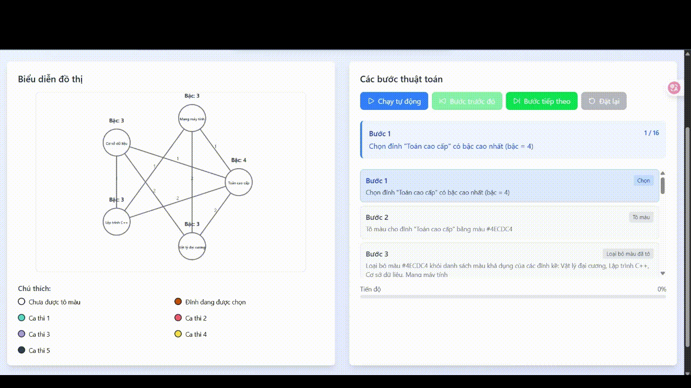

# Hệ Thống Xếp Lịch Ca Thi Tự Động (Tô Màu Đồ Thị)

## Giới thiệu

- Hệ thống xếp lịch ca thi tự động sử dụng thuật toán tô màu đồ thị để sắp xếp
  các ca thi một cách tự động, đảm bảo không có xung đột về thời gian và số ca
  thi tối ưu.

## Mô hình hóa

- Hệ thống áp dụng thuật toán tô màu đồ thị (Graph Coloring) để giải quyết bài toán xếp lịch thi:
  - [x] Đỉnh: mỗi môn học là một đỉnh trong đồ thị

  - [x] Cạnh: các đỉnh được xem là kề nhau nếu có ít nhất một sinh viên đăng ký cả hai môn học

  - [x] Màu: Mỗi màu đại diện cho một ca thi

## Các bước giải quyết

## Kết quả

## Lưu ý

- Nếu bài toán có thêm ràng buộc về số phòng thi và sức chưa của phòng thi thì
  không nên dùng tô màu để giải quyết bài toán.

- Thay vào đó hãy dùng các thuật toán heuristics, hoặc chia bài toán nhỏ hơn để
  giải quyết.
